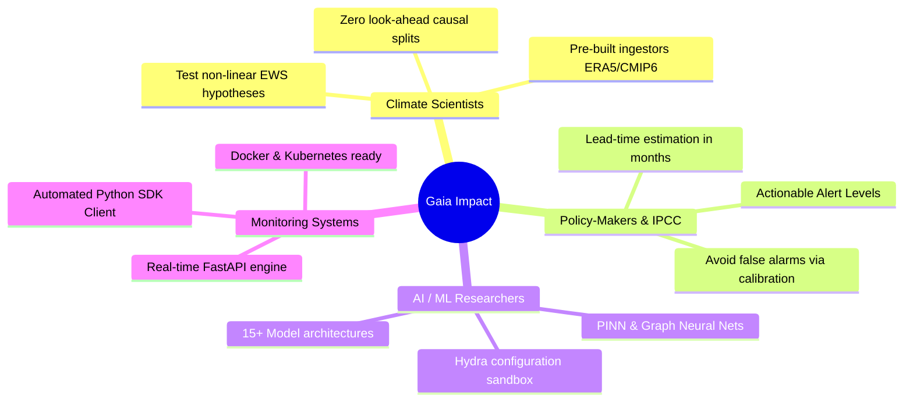

# Gaia 🌍

<div align="center">

[](https://github.com/gaia-ai/gaia/actions)
[](https://www.python.org/downloads/)
[](https://pytorch.org/)
[](https://fastapi.tiangolo.com/)
[](https://opensource.org/licenses/Apache-2.0)
[](https://github.com/psf/black)
[](https://github.com/astral-sh/ruff)
[](#-citation)
[](https://gaia-navy.vercel.app/)

**A Modular, Production-Ready, Research-Grade AI System for Early Detection of Climate Tipping Points**

[🌱 Why I Built This](#-why-i-built-this) •
[🌍 How It Helps](#-how-it-helps--real-world-impact) •
[🎮 Interactive Quickstart](#-interactive-quickstart) •
[⚡ Tipping Elements](#-supported-tipping-elements) •
[🏗️ Architecture](#-system-architecture) •
[📐 Technical Architecture](TECHNICAL_ARCHITECTURE.md) •
[🧠 Model Zoo](#-model-zoo) •
[📡 API & SDK](#-interactive-api--sdk-playground) •
[📖 Citation](#-citation)

---

```
   ██████╗  █████╗ ██╗ █████╗ 
  ██╔════╝ ██╔══██╗██║██╔══██╗
  ██║  ███╗███████║██║███████║
  ██║   ██║██╔══██║██║██╔══██║
  ╚██████╔╝██║  ██║██║██║  ██║
   ╚═════╝ ╚═╝  ╚═╝╚═╝╚═╝  ╚═╝  EARTH SYSTEM INTELLIGENCE
```

</div>

---

> [!IMPORTANT]
> **🌐 Live Interactive Demo & Real-Time Data**
> * **Vercel Live Deployment**: Explore the live **Space System Panel & Orbital Command Deck** frontend at **[https://gaia-navy.vercel.app/](https://gaia-navy.vercel.app/)**. 
>   *(Note: The online Vercel deployment runs in **High-Fidelity Research Simulation Mode** so visitors can explore 3D Earth visualizations, risk telemetry, and model architectures without needing a local GPU cluster or live Python runtime).*
> * **⚡ 100% Real-Time Data & Live AI Inference**: To experience real-time satellite data ingest and live PyTorch neural network inference, run the system locally! We have architected an **Automated Concurrent Startup Pipeline**—simply running `npm run dev` in `web/` (or at the project root) automatically wakes up and runs BOTH the FastAPI Python backend (`http://localhost:8000`) and the Next.js frontend (`http://localhost:3000`) simultaneously!

---

## 🌱 Why I Built This

Earth's climate system is not a linear machine; it is a complex, interconnected web of biophysical subsystems known as **tipping elements**. As anthropogenic warming pushes our planet toward critical thresholds, subsystems like the **Atlantic Meridional Overturning Circulation (AMOC)**, the **Amazon Rainforest**, and polar ice sheets approach instability points where self-reinforcing feedback loops can trigger **abrupt, irreversible, continental-scale state shifts**.

<details>
<summary><b>🚨 The Critical Gap in Traditional Climate Science (Click to Expand)</b></summary>
<br>

Historically, climate prediction has relied on two paradigms, both of which face severe limitations when predicting non-linear tipping points:
1. **General Circulation Models (GCMs) & Earth System Models (ESMs)**: While biophysically rigorous, traditional dynamical models are computationally prohibitive to run at high temporal resolutions for EWS screening. Furthermore, they often struggle with sub-grid parameterizations of tipping feedback loops (such as ice-albedo or soil moisture-vegetation dynamics), leading to delayed threshold recognition.
2. **Classical Statistical Mechanics**: Measures of **Critical Slowing Down (CSD)**—such as rising Lag-1 Autocorrelation ($AR(1)$) and rolling variance—provide foundational mathematical intuition. However, classical CSD indicators fail in high-dimensional, noisy satellite observations and cannot capture complex spatial teleconnections or multi-horizon non-linear dynamics.

</details>

I built **Gaia** to bridge this divide: creating an **open-source, modular, research-grade artificial intelligence engine** that unifies rigorous statistical mechanics with state-of-the-art deep learning. By treating Earth observational data (ERA5, CMIP6, MODIS, GRACE) with zero look-ahead causal preprocessing, graph spatial message passing, and physics-constrained loss functions, Gaia empowers the global scientific community to detect early-warning signals *before* critical thresholds are crossed.

---

## 🌍 How It Helps & Real-World Impact

Gaia is architected to deliver immediate, concrete value across four key pillars of the climate research and policy ecosystem:



### 1. 🔬 For Climate Scientists & Researchers
- **Accelerated Hypothesis Testing**: Eliminate months of boilerplate infrastructure engineering. Gaia includes ready-to-use Xarray/Dask loaders for **ERA5, CMIP6, MODIS MCD43A4, NASA GRACE, and NOAA Coral Reef Watch**.
- **Rigorous Causal Guarantee**: All temporal normalization and splitting pipelines strictly enforce **zero look-ahead bias**, ensuring your early-warning models reflect genuine physical predictability rather than data leakage.
- **Hybrid Domain Feature Engineering**: Automatically compute classical CSD metrics ($AR(1)$, rolling skewness, Detrended Fluctuation Analysis $\alpha$) alongside automated indices like **Degree Heating Weeks (DHW)**.

### 2. 🏛️ For Policy-Makers & IPCC Contributors
- **Actionable Alert Levels**: Instead of raw mathematical outputs, Gaia translates non-linear probabilities into clear operational severity alarms: `NORMAL` 🟢, `WATCH` 🟡, `WARNING` 🟠, and `CRITICAL` 🔴.
- **Lead-Time Quantification**: Computes estimated lead time steps before threshold transitions, providing vital time windows for proactive climate adaptation, resource allocation, and disaster mitigation.

### 3. 🧠 For AI & ML Engineers
- **State-of-the-Art Sandbox**: Explore and benchmark **15+ architectures** from a single YAML command—ranging from **Temporal Fusion Transformers (TFT)** and **Informers** to **Spatial Graph Attention Networks (GAT)** and **Physics-Informed Neural Networks (PINNs)**.
- **Complete Reproducibility**: Built with deterministic seed locking, Automatic Mixed Precision (AMP FP16/BF16), and native integration with **Weights & Biases** and **MLflow**.

### 4. 🛰️ For Automated Earth Monitoring Pipelines
- **Production-Ready Serving**: Deploy instantaneously via multi-stage Docker containers featuring a high-performance **FastAPI** inference engine with Pydantic validation and latency tracking.
- **Programmatic Python SDK**: Integrate live satellite telemetry and remote sensing data feeds directly into Gaia using the lightweight `GaiaClient` library.

---

## 🎮 Interactive Quickstart

Experience Gaia in action! You can launch the full-stack web platform with real-time AI inference, explore the CLI training pipeline, evaluate benchmarks, and test live REST predictions directly from your terminal.

<details open>
<summary><b>🌐 1. Launch Full-Stack Platform Locally (Real-Time AI + 3D Earth)</b></summary>
<br>

To experience 100% real-time data, live PyTorch neural network inference, and the Space System Panel UI on your local machine, run our automated dual-server startup command:

```bash
# Clone the repository
git clone https://github.com/iamnih4l/Gaia.git
cd Gaia

# Install backend dependencies (Python 3.10+)
pip install -r requirements.txt

# Start BOTH the FastAPI Python Backend and Next.js Frontend concurrently!
cd web
npm install
npm run dev
```
*💡 **How it works**: Our automated startup pipeline in `web/package.json` uses `concurrently` to automatically wake up and run the FastAPI backend on `http://localhost:8000` while starting the Next.js frontend on `http://localhost:3000`. When accessed locally, the frontend connects to your local runtime for real-time climate tipping point inference!*

</details>

<details>
<summary><b>🛠️ 2. Environment Setup (Poetry CLI & Python SDK)</b></summary>

```bash
# Clone the repository
git clone https://github.com/gaia-ai/gaia.git
cd gaia

# Install dependencies in a dedicated virtual environment
poetry install
poetry shell
```
</details>

<details>
<summary><b>🚂 3. Interactive Training Loop (CLI & Hydra)</b></summary>

Train a **Temporal Fusion Transformer** on AMOC circulation data. You can dynamically override hyperparameters directly from the command line without editing code:

```bash
# Train TFT on AMOC dataset with W&B logging enabled
poetry run python scripts/train.py \
    dataset=amoc \
    model=tft \
    training.batch_size=32 \
    training.epochs=50 \
    training.optimizer.lr=0.0005 \
    tracking.backend=wandb \
    project.seed=42
```
*💡 **Tip**: Try switching `model=tft` to `model=climate_gnn` or `model=pinn` to experiment with Graph Neural Networks or Physics-Informed loss functions!*
</details>

<details>
<summary><b>📊 4. Automated Benchmark Evaluation & Plotting</b></summary>

Evaluate trained models on hold-out test sequences and generate publication-grade ROC curves, Precision-Recall curves, and time-series EWS overlays:

```bash
poetry run python scripts/evaluate.py \
    dataset=amoc \
    model=tft \
    paths.output_dir=outputs/amoc_tft_eval
```
*📁 Generated dark-themed figures will be saved automatically to `outputs/amoc_tft_eval/figures/`.*
</details>

---

## ⚡ Supported Tipping Elements

Gaia provides specialized data ingestion, feature engineering, and labeling workflows for five continental-scale climate tipping elements:

<details open>
<summary><b>🌐 Click to View Tipping Element Matrix</b></summary>
<br>

| Tipping Element | Physical Mechanism & Driver | Key Dataset Source | Early Warning Signal Indicator |
| :--- | :--- | :--- | :--- |
| 🌊 **AMOC Slowdown / Collapse** | Atlantic Meridional Overturning Circulation Transport (Sv) | RAPID-MOCHA @ 26.5°N, CMIP6 | Variance & AR(1) rise, freshwater forcing sensitivity |
| 🌳 **Amazon Rainforest Dieback** | Vapor Pressure Deficit (VPD), Soil Moisture, NDVI/EVI | ECMWF ERA5, MODIS MCD43A4 | Drought recovery rate slowing, resilience loss |
| 🧊 **Greenland / Antarctic Ice Collapse** | Land Ice Mass Anomaly (Gt), Surface Melt Extent | NASA GRACE / GRACE-FO, ICEsat | Accelerating mass loss rate, spatial boundary retreat |
| 🪸 **Coral Reef Bleaching** | Sea Surface Temperature (SST), Degree Heating Weeks (DHW) | NOAA Coral Reef Watch v3.1 | Sustained DHW $\ge 8\ ^\circ\text{C-weeks}$, hotspot recurrence |
| ❄️ **Arctic Sea Ice Loss** | Arctic Sea Ice Extent & Area ($\text{km}^2$) | NSIDC Sea Ice Index (G02135) | Seasonal amplitude widening, multi-year ice depletion |

</details>

---

## 🏗️ System Architecture

Gaia enforces strict software engineering separation of concerns across five modular layers:

```mermaid
flowchart TB
    subgraph L1 [1. Ingestion Layer]
        direction TB
        A1[ERA5 / CMIP6 Reanalysis] --> REG[Dataset Registry]
        A2[MODIS / GRACE / NOAA] --> REG
        A3[RAPID AMOC / NSIDC] --> REG
    end

    subgraph L2 [2. Preprocessing & Feature Engineering Layer]
        direction TB
        REG --> B1[Temporal Processor: Detrending, Deseasonalization]
        B1 --> B2[Causal Normalizer: Zero Look-Ahead Splitter]
        B2 --> B3[EWS Indicators: AR1, Variance, Skewness, DFA α]
        B3 --> B4[Spatial Graph Constructor: Geographic KNN / Radius]
    end

    subgraph L3 [3. Neural Model Zoo Layer]
        direction TB
        B3 --> C1[Statistical Baselines: ARIMA, Logistic Reg, RF]
        B3 --> C2[Time-Series Transformers: TFT, Informer]
        B4 --> C3[Graph Neural Networks: ClimateGNN, GAT]
        B3 --> C4[Physics-Informed NNs & Causal PCMCI]
    end

    subgraph L4 [4. Training & Verification Layer]
        direction TB
        C1 & C2 & C3 & C4 --> D1[ClimateTrainer: Mixed Precision, Multi-GPU, MC Dropout]
        D1 --> D2[Evaluation Suite: ROC-AUC, Lead Time, FAR, ECE]
        D1 --> D3[Experiment Tracking: W&B / MLflow]
    end

    subgraph L5 [5. Production Serving Layer]
        direction TB
        D2 --> E1[FastAPI REST Engine]
        E1 --> E2[GaiaClient Python SDK]
        E1 --> E3[Multi-Stage Docker & Kubernetes Probes]
    end

    style L1 fill:#0d1117,stroke:#3b82f6,stroke-width:2px
    style L2 fill:#0d1117,stroke:#10b981,stroke-width:2px
    style L3 fill:#0d1117,stroke:#f59e0b,stroke-width:2px
    style L4 fill:#0d1117,stroke:#8b5cf6,stroke-width:2px
    style L5 fill:#0d1117,stroke:#ec4899,stroke-width:2px
```



---

## 🧠 Model Zoo

Gaia includes **15+ production-grade architectures** registered via `@register_model` in `ModelRegistry`. Explore the architecture categories below:

<details>
<summary><b>📈 1. Statistical & Classical Baselines</b></summary>
<br>

- **`arima`**: Automated Autoregressive Integrated Moving Average tracking critical slowing down transitions.
- **`logistic_regression`**: Regularized baseline utilizing rolling window EWS statistical features.
- **`random_forest` & `svm`**: Non-linear ensemble and kernel classifiers for interpretability benchmarks.
</details>

<details>
<summary><b>🤖 2. Time-Series Transformers & Attention</b></summary>
<br>

- **`time_series_transformer`**: Native multi-head self-attention encoder with CLS token pooling and attention interpretability extraction.
- **`temporal_fusion_transformer` (TFT)**: Advanced architecture combining Variable Selection Networks (VSN), Gated Residual Networks (GRN), and multi-horizon quantile forecasting.
- **`informer`**: Long-sequence time-series model utilizing ProbSparse attention and distilling operations for efficient memory scaling.
</details>

<details>
<summary><b>🌐 3. Graph Neural Networks (Spatial Teleconnections)</b></summary>
<br>

- **`climate_gnn`**: Graph Convolutional Networks (GCN) and GraphSAGE operating on geographic coordinate meshes.
- **`graph_attention` (GAT)**: Multi-head edge attention network identifying evolving teleconnection strengths across grid nodes.
- **`dynamic_graph`**: Spatio-temporal architecture combining spatial message passing with recurrent GRU cells for time-varying graphs.
</details>

<details>
<summary><b>⚛️ 4. Physics-Informed & Causal AI</b></summary>
<br>

- **`physics_informed_nn` (PINN)**: Neural network coupled with `PhysicsConstrainedLoss`, penalizing violations of mass and energy conservation laws.
- **`pcmci` & `granger`**: Non-linear causal discovery wrappers (via Tigramite) detecting true physical causation versus spurious correlations.
- **`foundation_adapter`**: Lightweight adapter interface for fine-tuning pre-trained atmospheric weather backbones (Aurora, ClimaX, Pangu-Weather).
</details>

---

## 📡 Interactive API & SDK Playground

Gaia is built for instant serving. Start the local server and interact with the REST API or Python SDK in real time.

### 1. Start the Server
```bash
# Launch FastAPI server with live reload
poetry run uvicorn api.app:app --host 0.0.0.0 --port 8000 --reload
```
*🌐 Interactive OpenAPI/Swagger Documentation is instantly available at: [http://localhost:8000/docs](http://localhost:8000/docs).*

### 2. Query via Python SDK (`GaiaClient`)
Copy and run this interactive Python snippet to test real-time tipping point risk assessment:

```python
from api.client import GaiaClient

# 1. Initialize client connection
with GaiaClient(base_url="http://localhost:8000") as client:
    
    # 2. Verify server health and GPU acceleration
    health = client.health()
    print(f"System Health: {health['status']} | GPU Available: {health['gpu_available']}")

    # 3. Submit a synthetic 12-step ocean observational sequence
    sequence = [
        {
            "timestamp": f"2024-{m:02d}-01",
            "features": {
                "sst_anomaly": 0.5 + 0.12 * m,  # Warming trend
                "ar1": 0.40 + 0.05 * m,         # Critical slowing down
            }
        }
        for m in range(1, 13)
    ]

    # 4. Request tipping prediction, alarm status, and 95% confidence bounds
    response = client.predict(
        sequence=sequence,
        tipping_element="coral",
        model_name="temporal_fusion_transformer",
        return_uncertainty=True,
    )

    # 5. Display actionable results
    print("\n" + "═" * 45)
    print(f" 🎯 TIPPING PREDICTION REPORT: {response.tipping_element.upper()}")
    print("═" * 45)
    print(f" • Architecture       : {response.model_name}")
    print(f" • Tipping Probability: {response.tipping_probability:.2%}")
    print(f" • Alarm Status       : {response.alert.alert_level} {'🔴' if response.alert.alarm_triggered else '🟢'}")
    if response.alert.estimated_lead_time_steps:
        print(f" • Estimated Lead Time: {response.alert.estimated_lead_time_steps} time steps")
    if response.uncertainty:
        print(f" • 95% Confidence     : [{response.uncertainty['lower_95']:.4f}, {response.uncertainty['upper_95']:.4f}]")
    print("═" * 45 + "\n")
```

### 3. Or Query via cURL
<details>
<summary><b>💻 Click to View cURL Command</b></summary>

```bash
curl -X POST "http://localhost:8000/predict" \
     -H "Content-Type: application/json" \
     -d '{
       "model_name": "temporal_fusion_transformer",
       "tipping_element": "amoc",
       "sequence": [
         {"timestamp": "2024-01-01", "features": {"transport_sv": 18.5, "ar1": 0.41}},
         {"timestamp": "2024-02-01", "features": {"transport_sv": 18.2, "ar1": 0.45}},
         {"timestamp": "2024-03-01", "features": {"transport_sv": 17.9, "ar1": 0.51}},
         {"timestamp": "2024-04-01", "features": {"transport_sv": 17.5, "ar1": 0.58}},
         {"timestamp": "2024-05-01", "features": {"transport_sv": 17.1, "ar1": 0.64}},
         {"timestamp": "2024-06-01", "features": {"transport_sv": 16.8, "ar1": 0.72}},
         {"timestamp": "2024-07-01", "features": {"transport_sv": 16.4, "ar1": 0.78}},
         {"timestamp": "2024-08-01", "features": {"transport_sv": 16.0, "ar1": 0.83}},
         {"timestamp": "2024-09-01", "features": {"transport_sv": 15.6, "ar1": 0.88}},
         {"timestamp": "2024-10-01", "features": {"transport_sv": 15.2, "ar1": 0.91}},
         {"timestamp": "2024-11-01", "features": {"transport_sv": 14.8, "ar1": 0.94}},
         {"timestamp": "2024-12-01", "features": {"transport_sv": 14.3, "ar1": 0.97}}
       ],
       "return_uncertainty": true
     }'
```

</details>

---

## 🐳 Docker & CI/CD Deployment

Gaia is pre-configured for automated enterprise deployment:

```bash
# Launch API server, MLflow Tracking UI (port 5000), and TensorBoard (port 6006)
docker-compose up -d --build

# Verify container liveness probe
curl http://localhost:8000/health
```

---

## 📄 License

This project is licensed under the **Apache License 2.0** — see the [LICENSE](LICENSE) file for details.

---

## 📖 Citation

If you use `Gaia` in your research or operational systems, please cite:

```bibtex
@software{gaia_2026,
  title  = {Gaia: A Modular, Research-Grade AI System for Early Detection of Climate Tipping Points},
  author = {Gaia Research Team},
  year   = {2026},
  url    = {https://github.com/gaia-ai/gaia},
  note   = {Version 1.0.0-prod}
}
```
