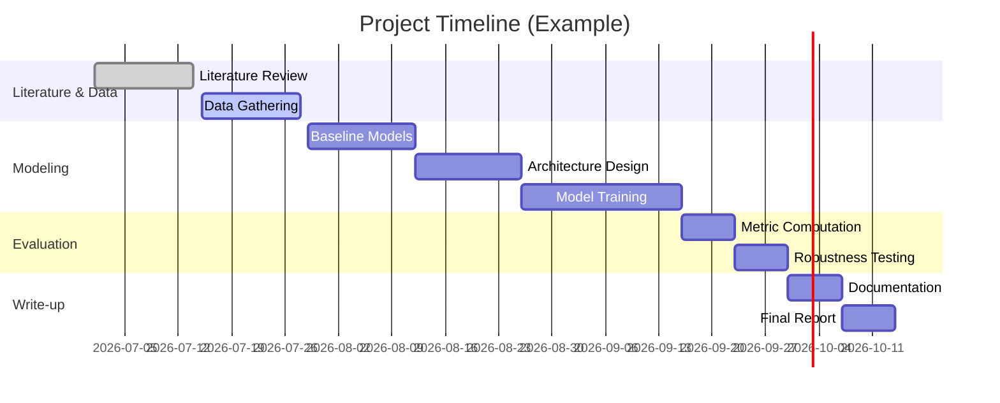

# AI for Early Detection of Climate Tipping Points (Capstone Project Plan)

## Executive Summary  
This project aims to develop AI-driven methods to detect subtle *early-warning signals* of critical climate tipping points (e.g. Amazon dieback, AMOC slowdown, ice-sheet collapse, coral reef bleaching) **before** irreversible shifts occur. By combining Earth‐system data with state-of-the-art machine learning (ML) (foundation models, time-series transformers, graph neural nets, causal inference, physics-informed ML), the team will explore whether trending indicators (like rising autocorrelation or variance) can be detected and learned by AI models. The deliverables include (a) a comprehensive research plan, (b) curated datasets of relevant climate variables, (c) baseline and advanced ML models, (d) evaluation of early-warning performance, and (e) documentation with reproducible code. Success is measured by the ability to predict known historical tipping events with positive *lead time* (e.g. months before collapse) and low false-alarm rates. The project is structured as a 6–12 week undergraduate capstone, with a multidisciplinary team covering climate science, data engineering, and ML. Milestones include literature review, data acquisition, baseline modeling, advanced model development, and evaluation. Tables summarize candidate datasets, ML architectures, and evaluation metrics. We also discuss ethical, reproducibility, and compute considerations. Throughout, we cite peer-reviewed literature and major sources (IPCC, Nature, NOAA, etc.) to ground the approach in established science.

## Project Goals, Questions, and Hypotheses  
- **Goal:** Enable early detection of approaching climate tipping points via AI, to provide advance warning and inform mitigation.  
- **Research Questions:** (1) *What statistical precursors (early-warning signals, EWS) can be reliably detected before tipping events in key systems?* (2) *Which AI/ML architectures best learn these signals from high-dimensional climate data?* (3) *How much lead time (predictive horizon) can the AI provide, and how does this trade off against false alarms?* (4) *Can causal and physics-informed methods improve interpretability and robustness of predictions?*  
- **Hypotheses:** For many tipping elements (Amazon, AMOC, ice sheets, coral reefs), classical theory predicts *critical slowing down* (CSD) – a rise in autocorrelation and variance of key variables as thresholds approach. We hypothesize that ML models can learn such generic patterns, possibly combining them with system-specific features, to detect warning signals. We expect that (a) combining multiple indicators (e.g. spatial patterns, network connectivity) via GNNs or ensemble models will outperform single-statistic methods; (b) foundation models pretrained on large climate data (e.g. “Aurora”) can be fine-tuned for early-warning tasks; and (c) causal discovery algorithms (e.g. PCMCI, LKIF) can help identify driving factors and reduce spurious alerts.  
- **Success Criteria:** The project will be successful if it can identify at least one measurable early-warning indicator for each focal tipping system, demonstrated by: (i) a statistically significant increase in detection skill (e.g. higher True Positive Rate for a given False Positive Rate) compared to naive baselines; (ii) a positive *lead time* (i.e. predictions on average precede the actual tipping event); and (iii) robust performance under data variations (see metrics below). Quantitatively, we target ROC AUC >0.8 (if feasible) and maintain false-alarm rates below ~10%. Achieving publishable-quality results on synthetic or historical case studies would count as strong evidence of success.

## Background Knowledge and Skills  
Team members should have: 
- **Climate Science & Complex Systems:** Understanding of Earth system tipping elements (Amazon rainforest, AMOC, ice sheets, coral reefs), their feedbacks and data proxies. Familiarity with time-series analysis (critical slowing down, autocorrelation, variance) is essential. Knowledge of Earth data sources (reanalysis, satellite, climate models) is required. 
- **Machine Learning & Statistics:** Experience with deep learning (transformers, CNNs, GNNs), time-series models, and probabilistic forecasting. Skills in causal inference (e.g. Granger causality, PCMCI) and physics-informed methods strengthen the project. Background in scientific ML (e.g. physics constraints, PDE models) is a plus. 
- **Data Engineering & Programming:** Ability to preprocess large spatiotemporal datasets (netCDF, GRIB) using Python (NumPy, xarray, Pandas), and to run ML training (PyTorch or TensorFlow). Familiarity with HPC or cloud computing will help manage compute tasks. 
- **Team Skills:** Communication skills for interdisciplinary collaboration. At least one member should know software version control (Git/GitHub) and documentation.  

## Team Composition and Time Commitment (6–12 weeks)  
A recommended team might include:  
- **Climate Scientist (30% time):** Leads domain research, identifies tipping elements and data sources, guides feature selection.  
- **ML/Data Scientist (40% time):** Designs and trains ML models (transformers, GNNs, etc.), engineers training pipeline, tunes hyperparameters.  
- **Software Engineer (20% time):** Implements data pipelines, ensures reproducibility (Docker/Colab notebooks), builds evaluation framework.  
- **Domain Expert / Advisor (10% time):** Advises on climate details (e.g. which datasets to trust, model biases) and project scoping.  
   
For a 10-week project, each undergraduate might spend ~10–15 hours/week (roughly 100–150 person-hours total). Early weeks focus on literature review and data collection; later weeks on modeling and writing. Meetings every 1–2 weeks will align tasks.  

## Workplan, Milestones, and Deliverables  
A typical timeline (10-week capstone) could be:



- **Weeks 1–2 (Literature/Data):** Survey tipping-point theory and EWS. Identify relevant datasets (see next section), obtain access, and write code to load them. Deliverable: annotated bibliography and initial data inventory.  
- **Weeks 3–4 (Baselines):** Preprocess data (see below), compute simple early-warning indicators (lag-1 autocorrelation, variance) for historical tipping events if available. Build basic classifiers (e.g. logistic regression or ARIMA-based) as baselines. Deliverable: baseline performance report.  
- **Weeks 5–7 (Advanced Models):** Implement proposed architectures (e.g. time-series transformer, GNN, causal nets). Pretrain or fine-tune on large climate data if using foundation-model approach. Run experiments to compare methods. Deliverables: trained model code, interim results (graphs of metrics).  
- **Weeks 8–9 (Evaluation/Robustness):** Evaluate models using the defined metrics (lead time, ROC, etc.), including cross-validation or split-sample tests. Test robustness to data noise or missing values. Deliverable: evaluation results and visualizations.  
- **Week 10 (Reporting):** Compile findings into final report, including tables and mermaid diagrams. Deliverable: comprehensive project report with code appendix. 

Effort estimates (person-hours) per task are on the order of 20–30 hours each, with overlaps possible (e.g. one person does data prep while another explores baseline models).

## Dataset Inventory

| Dataset                         | Source/Variables                        | Resolution / Coverage                          | Access / License                       |
|---------------------------------|-----------------------------------------|-----------------------------------------------|----------------------------------------|
| **ERA5 Reanalysis**             | Atmosphere (T, P, winds, humidity, etc.) | 0.25° lat-lon, hourly (1950–present) | Open (Copernicus CDS)     |
| **CMIP6 Model Output**          | Multi-model climate variables (TCBs, OHC, etc.)           | ~100–200 km, monthly (pre-industrial–2100)    | Open (WCRP/ESGF nodes)    |
| **MODIS/VIIRS Vegetation Index**| NDVI/EVI over land (for Amazon)        | 0.05° lat-lon, 8-day or monthly composites (2000–present) | Open (NASA LP DAAC)      |
| **Terra/MODIS VOD**             | Vegetation Optical Depth (forest biomass) | 0.25° lat-lon, monthly (1992–2016)            | Open (ESA CCI)     |
| **NOAA Coral Reef Watch (CRW)** | SST anomalies, Degree Heating Week (coral stress) | 0.05° (~5km), daily (1985–present)             | Open (NOAA)            |
| **GRACE/GRACE-FO**              | Land ice mass change (Greenland/Antarctica) | ~150 km, monthly (2002–2017, 2018–present)   | Open (NASA/CSR)    |
| **Sea Ice Index (NSIDC)**       | Arctic/Antarctic sea ice extent        | Monthly (1979–present)                        | Open (NSIDC)       |
| **RAPID/MOCHA/OSNAP**           | AMOC transport (subpolar Atlantic)      | Station data (2004–present, monthly)          | Open (CCHDO)       |

Each dataset will require downloading and integration. Datasets like ERA5 and CMIP6 are very large; we may use subsets or aggregated diagnostics. Licensing is generally open (CC-BY or equivalent) for all listed.

### Preprocessing Steps  
- **Temporal Harmonization:** Resample all data to common temporal resolution (e.g. monthly or seasonal averages) after removing seasonal cycle (compute anomalies). Some tipping signals (like rising AR(1)) assume detrended, de-seasonalized data.  
- **Spatial Subsetting:** For system-specific signals, extract relevant regions: Amazon basin pixels, North Atlantic for AMOC, Greenland/Antarctic areas for ice, reef locations for coral. Possibly aggregate spatially (e.g. mean Amazon vegetation).  
- **Feature Engineering:** Compute known EWS metrics on each time series: lag-1 autocorrelation, variance, skewness. Also compute domain-specific indices: e.g. Palmer Drought Severity Index for Amazon, Southern Greenland melt index, DHW for coral.  
- **Normalization:** Scale input features (e.g. to zero mean, unit variance) for ML training. Be cautious to apply normalization only using past data (no look-ahead).  
- **Data Labeling:** Define "tipping event" labels (e.g. year of major dieback in model or observation) to supervise classification. In absence of many real events, synthetic perturbation scenarios (from models) may be used to generate positive examples.  
- **Train/Test Split:** Use past/present data as training, reserve final decades for testing model forecasting. Cross-validation can be done by withholding one tipping “event” period at a time.

## Baseline Models  
Before advanced AI, we will implement simple baselines:  
- **Statistical Indicators:** Threshold-based alarms (e.g. trigger if autocorrelation or variance exceeds historical 95th percentile).  
- **ARIMA/Time-Series:** A univariate AR(1) model predicting slowdown, or logistic regression using generic EWS as features.  
- **Persistence/Climatology:** Always predicting “no tipping” or using climatological mean (to assess trivial skill).  
- **Classical ML:** Random forest or SVM on handcrafted features (lag-1 AC, variance, trend).  

These baselines establish reference performance. For example, Boulton et al. found that in a complex Amazon model the generic EWS (autocorrelation) **failed** in tree cover but variance rose spuriously due to forcing; such behavior will test our baselines.  

## Proposed Model Architectures  
We plan to compare and possibly combine several ML architectures:

- **Foundation (Pretrained) Model:** A large spatiotemporal model pretrained on general climate data, then fine-tuned for EWS detection. For example, *Aurora* (a 1.3B-parameter Earth system foundation model) was pretrained on ~1 million hours of geophysical data, achieving state-of-art forecasts across domains. We may use a smaller climate pretraining (e.g. on ERA5 sequences) and fine-tune for classification/regression of tipping risk.  
- **Time-Series Transformers:** Sequence models like Informer, Temporal Fusion Transformer, or 3D Swin Transformer (as used in Aurora) applied to long climate time series. These handle long-range dependencies (critical for early signals) and multivariate inputs (e.g. temperature, precipitation). Self-attention may capture emergent patterns of CSD across lagged features.  
- **Graph Neural Networks (GNNs):** Represent the spatial climate domain as a graph (nodes = grid cells or regions, edges based on proximity or teleconnections). A GNN can learn how spatially distributed anomalies propagate. For example, a climate GNN might detect the network signature of a weakening AMOC across North Atlantic SST/Sales. GNNs excel in incorporating complex non-Euclidean relationships, which is promising for interconnected systems like Earth’s climate.  
- **Causal Discovery/Models:** Apply causal inference methods (e.g. PCMCI, PCMCI+ partial correlation, or information flow algorithms) to learn causal graphs among climate variables. For instance, identify if Arctic ice loss causally drives cooling patterns. Embedding causal structure in the model (or post-analyzing model outputs for causality) can enhance interpretability and reduce false triggers due to confounding. The IIASA study by Lohmann et al. shows distinct strengths of causal methods (PCMCI, LKIF, Granger) depending on data characteristics.  
- **Scientific/Physics-informed ML:** Incorporate known physical constraints (e.g. conservation laws, PDEs) into ML models. This could involve physics-informed neural networks (PINNs) that respect conservation of mass/energy, or using known analytical EWS indicators as additional features (e.g. Jacobian eigenvalues from simple models). Enforcing physical consistency may improve robustness to outliers.  

Table 1 summarizes candidate architectures:

| Model Type             | Example Framework              | Pros                                                  | References               |
|------------------------|--------------------------------|-------------------------------------------------------|--------------------------|
| **Pretrained (“foundation”)**  | Aurora-like Transformer (1.3B params) | Very powerful; leverages large-scale data; fine-tunable |  |
| **Time-Series Transformer** | Informer, TFT, 3D Swin（Vision-T） | Captures long-range temporal patterns; handles sequences |              |
| **Graph Neural Network** | DCRNN, GraphConv/GAT on climate grid | Models spatial interactions; suited for irregular domains |           |
| **Causal Model**      | PCMCI / Graph Neural w/ causal layers | Identifies directional links; reduces spurious signals   |           |
| **Physics-Informed NN** | PINN (ODE/PDE embed)      | Respects known physics; can use differential info        | –                        |

We will experiment with combining these (e.g. using both a Transformer and a GNN ensemble). The exact architecture will depend on data availability – e.g. if spatial context is important (use GNN), if large pretraining is feasible (use foundation model).

## Training Regime and Procedures  
- **Supervised vs Unsupervised:** If labeled tipping events are scarce, we may resort to unsupervised or semi-supervised approaches. One strategy is to treat known abrupt changes (e.g. simulated dieback in models) as “events” and train a classifier. Alternatively, use autoencoders or forecasting-based losses: flag anomalies where prediction error rises.  
- **Data Augmentation:** Create synthetic scenarios by stressing models (e.g. gradually increasing CO₂ in simulations) to generate training examples of tipping. Add noise perturbations to time series to improve generalization.  
- **Cross-Validation:** Use time-block CV (e.g. leave-one-event-out) because temporal dependency is strong. For example, train on pre-2000 AMOC slowdown data, test on 2000–present.  
- **Hyperparameters:** Tune via grid search or Bayesian optimization on validation splits. Learning rates, number of layers, sequence length, etc. will be crucial, especially for Transformers.  
- **Compute Setup:** Likely use GPUs (e.g. NVIDIA A100 or V100) or TPUs. A large foundation model may require multiple GPUs (distributed training). Fine-tuning smaller models or training mid-sized networks can be done on a single high-end GPU.  
- **Loss Functions:** If framing as classification (“tipping vs safe”), use binary cross-entropy. If regression (predict time-to-tipping or tipping probability), use MSE or negative log-likelihood. We will emphasize probabilistic outputs (sigmoid probabilities) to allow for calibration analysis.

## Evaluation Metrics  
Early-warning detection has specialized metrics:  

- **Lead Time (LT):** *Time in advance of the actual tipping point when a warning is triggered*. Longer LT means more early notice. If $t_c$ is tipping time and $t_w$ is warning time, $LT = t_c - t_w$. We will report average LT for true positives. (Aim: positive values, e.g. months ahead).  
- **False Alarm Rate (FAR):** Fraction of predicted tipping alerts that were false (no actual event). Lower FAR is critical to avoid false panic.  
- **Detection Rate / Recall:** Fraction of actual tipping events correctly flagged. (Higher is better, but trade-offs with FAR).  
- **ROC-AUC:** Area under Receiver Operating Characteristic curve, summarizing true-positive vs false-positive rate across thresholds. A high AUC (>0.8) indicates good discrimination.  
- **Precision-Recall:** Especially if events are rare, PR-AUC can be more informative than ROC. Precision (positive predictive value) vs Recall (detection rate).  
- **Calibration:** Measures how well predicted probabilities match observed frequencies. E.g. reliability diagrams or Brier score. A well-calibrated model’s risk outputs are trustworthy.  
- **Cost-based Metrics:** If a “cost” of false alarms vs misses can be estimated, one could optimize expected utility or use F1 score (harmonic mean of precision and recall).  

These metrics will be computed on held-out test periods. We will also inspect time-series plots of predictions vs actual events. Table 2 compares key metrics:

| Metric               | Definition / Goal                               | Range            | Desired Direction |
|----------------------|-------------------------------------------------|------------------|-------------------|
| Lead Time (LT)       | $t_{\rm event} - t_{\rm warning}$ (time ahead)  | ($-\infty,\infty$) days | **Maximize** (positive) |
| False Alarm Rate     | $\frac{\#FP}{\#Predictions}$                    | 0 to 1           | **Minimize**      |
| True Positive Rate   | $\frac{\#TP}{\#Actual Events}$ (Recall)         | 0 to 1           | **Maximize**      |
| ROC AUC              | Area under ROC curve (TPR vs FPR)               | 0 to 1 (0.5=random) | **Maximize**    |
| Precision-Recall AUC | Area under Precision-Recall curve               | 0 to 1           | **Maximize**      |
| Calibration Error    | e.g. Expected calibration error (Brier score)   | 0 to 1           | **Minimize**      |

By focusing on lead time and false alarms, we ensure the AI does provide *actionable* early alerts with acceptable reliability.  

## Robustness and Uncertainty Quantification  
To ensure trustworthy predictions, we will:  
- **Ensembles:** Train multiple models (with different initializations or subsets of data) and aggregate (e.g. average probability). Spread across ensemble gives an uncertainty estimate.  
- **Monte Carlo Dropout:** Use dropout at inference to approximate Bayesian uncertainty.  
- **Data Perturbation Tests:** Evaluate sensitivity by adding noise or withholding parts of data to see if predictions change drastically (stress testing).  
- **Validation on Synthetic/Out-of-Sample Scenarios:** Test the model on climate model runs or extreme events it didn’t train on.  
- **Explainability:** Apply techniques (e.g. attention maps, saliency, or SHAP values) to identify which features/time periods the model used, to check if it aligns with known physics (critical slowing, e.g.).  

These steps help avoid overfitting to particular patterns and allow us to quantify confidence. For example, we will check that probability outputs are well-calibrated (e.g. via reliability diagrams).  

## Ethical, Reproducibility, and Governance Considerations  
- **Scientific Integrity:** Use only well-documented, peer-reviewed datasets and avoid misinterpreting signals. For instance, caution is needed because past studies found that rising variance can be **spurious** due to forcing (e.g.).  
- **Data Ethics:** All data used are publicly available climate datasets (no personal data). Citation and credit to data providers (IPCC, NASA, NOAA) will be maintained.  
- **Transparency:** We will publish code and data processing scripts (e.g. on GitHub) so others can reproduce results. All random seeds and software versions will be logged.  
- **Compute Footprint:** We will track computational cost (GPU-hours) to estimate energy usage. For large models, we’ll consider using cloud with renewable energy (if possible) or local servers to minimize carbon footprint.  
- **Communication of Uncertainty:** When presenting results, we will clearly communicate uncertainties and avoid alarmism. We will stress that AI offers probabilistic *warnings* not certainties, aligning with the precautionary principle as noted for AMOC.  
- **Policy Relevance:** Although not a policy project, we will discuss how early warnings could integrate into decision-making (with caveats). Ethical use means not using the model to cause undue panic – rather to guide timely research or adaptation efforts.  

## Compute and Cost Constraints  
We assume no fixed budget but must be practical for an undergraduate team. Rough estimates:  
- **Foundation Model Training:** Models like Aurora (1.3B params) require large clusters (e.g. hundreds of GPUs for weeks). We likely will use a smaller scale (100–500M params) or leverage existing pretrained weights. Fine-tuning such models may cost on the order of 50–200 GPU-hours (depending on data size).  
- **Transformer/GNN Training:** Medium-scale networks (~10–100M params) may take ~10–50 GPU-hours to train on climate data. For example, training a transformer on ERA5 sequences (at 0.25° resolution) could be done with 1–4 GPUs in a few days.  
- **Cloud vs Local:** Using university HPC or cloud (AWS/GCP) is viable. For budgeting, note that an AWS V100 GPU costs ~$3 per hour. A 100-hour run is ~$300. We will optimize batch sizes and use early stopping to limit waste. Data storage (satellite and reanalysis) could be ~10s of TB; we may work with subsets to fit on local drives.  
- **Reproducibility:** Containerization (Docker) or Colab notebooks will encapsulate the compute environment. All heavy computations (model training) will be logged with hardware specs (GPU type, number of GPUs, CPU time).  

By prioritizing modular code and lightweight experiments, the project stays feasible on moderate compute resources. If needed, we will defer extremely expensive components (full foundation pretraining) and focus on fine-tuning or smaller networks.

## Suggested Visualizations  
To analyze and present results, we will use:  

- **Maps:** Geospatial heatmaps of variables (e.g. sea surface temperature trends, vegetation stress) and model outputs. For example, plotting spatial maps of coral DHW anomalies or Arctic ice decline to show where risks concentrate.  
- **Time Series Plots:** Overlay model probability vs true tipping indicator over time (showing lead-time). E.g. plot Amazon NDVI time series with autocorrelation trending and model-predicted risk.  
- **ROC and Precision-Recall Curves:** Standard evaluation plots to compare models.  
- **Reliability Diagrams:** To check calibration of predicted probabilities.  
- **Network Graphs:** For GNN, visualize climate interaction graphs or attention weights (if applicable).  
- **Feature Importance Charts:** Bar plots or saliency maps to show which variables or lags the model used most (e.g. which climate index mattered).  
- **Mermaid Diagrams:** (below) to illustrate the data pipeline and model architecture in the documentation.  

Each visualization will aid in diagnosing model behavior. For instance, a figure of NOAA’s coral DHW index (Figure below) vividly shows how high accumulated heat stress precedes reef bleaching.

 *Figure: NOAA Coral Reef Watch global Degree Heating Week (DHW) map on 25 July 2026 (purple=high thermal stress). DHW sums weekly sea-surface temperature anomalies (4°C-weeks risks bleaching, ≥8°C-weeks causes mass mortality). Such data provide concrete early-warning indicators of coral tipping.*  

```mermaid
graph LR
    subgraph "Data & Features"
      A[Raw Climate Data (satellite, reanalysis, models)] --> B[Preprocessing: cleaning, anomaly calculation]
      B --> C[Feature Extraction: AR(1), variance, indices]
    end
    subgraph "Models"
      C --> D[Time-Series Transformer Model]
      C --> E[Graph Neural Network Model]
      C --> F[Causal Inference Model]
      D --> G[Ensemble / Prediction]
      E --> G
      F --> G
    end
    subgraph "Output"
      G --> H[Early Warning Alerts / Probabilities]
    end
```

```mermaid
graph LR
    subgraph "Workflow"
        1[Define tipping elements & data sources] --> 2[Collect & preprocess data]
        2 --> 3[Compute baseline signals (AR1, variance)]
        3 --> 4[Train ML models (Transformer, GNN, etc.)]
        4 --> 5[Evaluate models (lead time, ROC, calibration)]
        5 --> 6[Refine models and compute uncertainty]
        6 --> 7[Document results & code]
    end
```

## References  

The plan above builds on established science: critical slowing down and EWS in climate systems; recent findings of Amazon resilience loss; observed AMOC early-warning evidence; and state-of-art ML in Earth science (e.g. foundation models, GNNs, causal methods). Datasets like ERA5 and NOAA DHW are standard in the community. Throughout, primary sources (IPCC glossary, Nature journals, Copernicus, NOAA) ensure rigor. The team will adhere to open, reproducible research practices at every step.